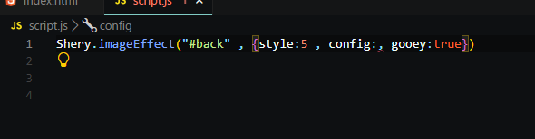

# Shery.js - A Powerful JavaScript Library

Shery.js is a l JavaScript library i stumbled upon through youtube designed by the sheryians youtube channel , they made this to enhance web development with smooth animations, interactions, and other advanced features.

## Features
- it felt easy to understand
- fast
- Provides smooth animations and effects that are just so 
laborious to make without this library

---

## Installation Guide
So here are the steps to download it on your own pc and have fun.....

### 1. Include Shery.js via CDN
To quickly use Shery.js, include the following CDN link in your HTML file:
```html just above your style.css file
<link rel="stylesheet" href="https://unpkg.com/sheryjs/dist/Shery.css" />
```

Then, import it in your JavaScript file:
```js just above body tag
<script  type="text/javascript"  src="https://unpkg.com/sheryjs/dist/Shery.js"></script> 
```


---

## Screenshots

* [You have to write this code to start the effect and debug it]
  
  

* [this is the interface that you will see after opening the webpage]
  
  

* [This is a debugger that comes with Shery.js itself. You can customize the effect according to your need from this debug panel and then you can copy the settings to the clipboard.]
  
  

* [After you get your desired effect, write this]
  
  

* [Then paste the complete text in the config area to apply the effect to the webpage.]
   
  


## Documentation

- Official Website: [Shery.js]([https://sheryjs.com](https://www.npmjs.com/package/sheryjs))

---


